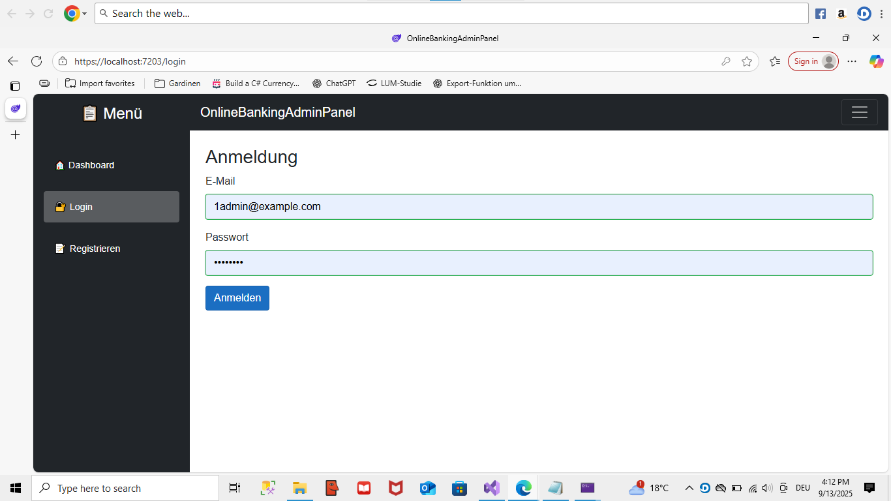
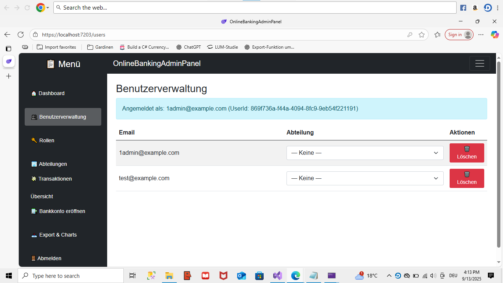
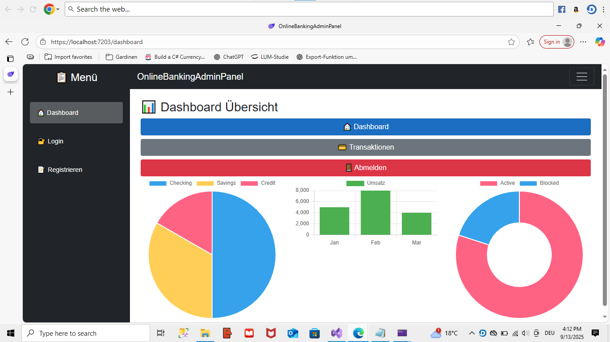
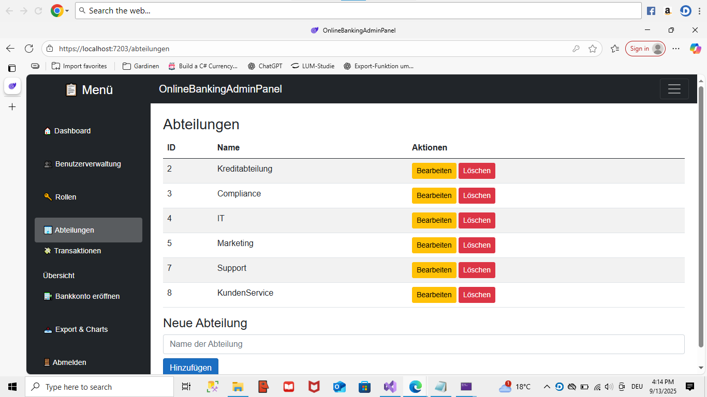
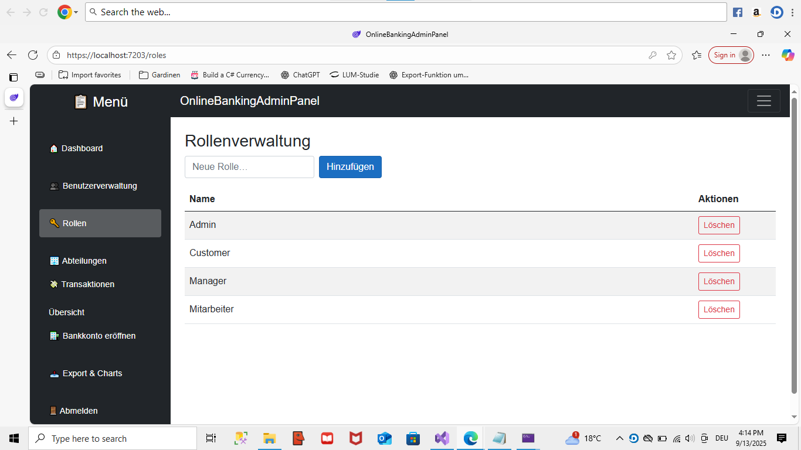
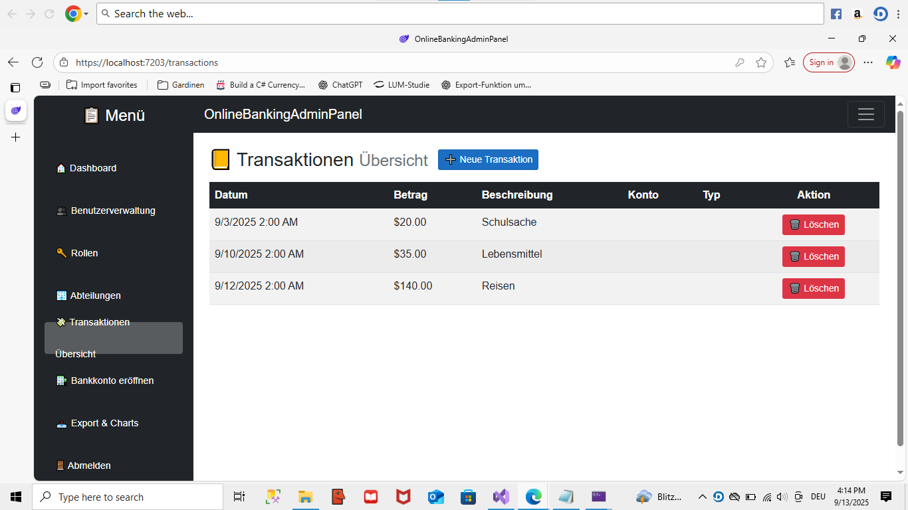

# OnlineBankingApp
Eine vollständige **Online-Banking Demo** mit **ASP.NET Core 8**, **EF Core (SQL Server)**, **ASP.NET Identity + JWT** und einem **Blazor Server Admin Panel**.  
Ziele: saubere Architektur, realistische Features (Konten, Transaktionen, Rollen/Abteilungen), Export (Excel/PDF) und einfache lokale Inbetriebnahme.

## Inhaltsverzeichnis
- [Features](#features)
- [Technologien](#technologien)
- [Architektur & Projektstruktur](#architektur--projektstruktur)
- [Schnellstart](#schnellstart)
- [Standard-Logins & Seeding](#standard-logins--seeding)
- [Wichtige Endpunkte](#wichtige-endpunkte)
- [Rollen & Berechtigungen](#rollen--berechtigungen)
- [Berichte & Exporte](#berichte--exporte)
- [Konfiguration](#konfiguration)
- [Troubleshooting](#troubleshooting)
- [Screenshots](#screenshots)
- [Lizenz](#lizenz)
- [Kontakt](#kontakt)

## Features
- Registrierung & Login (JWT)
- Rollen/Policies: **Admin**, **Manager**, **Mitarbeiter** + Policy **CanManageUsers**
- **Benutzerverwaltung** im Admin Panel (anzeigen/löschen, Abteilung zuweisen)
- **Rollenverwaltung** (Liste, anlegen, löschen)
- **Bankkonten**: anlegen, anzeigen (pro Benutzer), optional: 1 Konto pro Benutzer
- **Transaktionen**: Einzahlung, Auszahlung, Transfer (mit Buchungen)
- **Berichte**: Monatsdiagramm (`GET /api/TransactionExport/monthly-chart-data`)
- **Export**: Excel (`/api/TransactionExport/excel`), PDF-Kontoauszug (`/api/TransactionExport/pdf`)
- **Swagger/OpenAPI** für die API

## Technologien
- **Backend (API):** ASP.NET Core 8 (Web API), ASP.NET Identity, JWT (Bearer)
- **Datenbank:** SQL Server, EF Core
- **Admin UI:** Blazor Server
- **Export:** ClosedXML (Excel), eigener PDF-Generator
- **Auth:** JWT mit Claims (NameIdentifier, Name, Role)
- **Logging:** Microsoft.Extensions.Logging (optional Serilog)

## Architektur & Projektstruktur
OnlineBankingApp.sln
README.md
OnlineBankingApp.API/ # Web API (Auth, Users, BankAccounts, Exporte, Reports)
OnlineBankingAdminPanel/ # Blazor Server Admin-Frontend (Users, Roles, Reports, Konto anlegen)
OnlineBankingApp.Infrastructure/ # EF Core DbContext, Services (BankAccountService, Export, Seeder)
OnlineBankingApp.Application/ # Interfaces, DTOs, Policies
OnlineBankingApp.Domain/ # Entities (BankAccount, Transaction, ApplicationUser, ...)
OnlineBankingApp.Shared/ # Geteilte DTOs für UI/API


### Wichtige Controller (API)
- **AuthController:** `/api/auth/login`, `/api/auth/register`, `/api/auth/me`
- **UsersController:** `/api/users`, `/api/users/{id}`, `/api/users/roles`, `PUT .../abteilung`
- **BankAccountsController:** `/api/bankaccounts` (CRUD/Read), benutzergebunden
- **TransactionExportController:** Exporte + Monatsdaten

## Schnellstart
**Voraussetzungen**
- .NET 8 SDK  
- SQL Server (lokal/Express/Docker)  
- (Optional) EF Core Tools: `dotnet tool install --global dotnet-ef`

**1) Repository klonen**
```bash
git clone <DEIN-REPO-URL>
cd OnlineBankingApp


2) Verbindung & JWT konfigurieren (lokal, Beispiel)
OnlineBankingApp.API/appsettings.json:

{
  "ConnectionStrings": {
    "DefaultConnection": "Server=.;Database=OnlineBankingDb;Trusted_Connection=True;TrustServerCertificate=True"
  },
  "Jwt": {
    "Key": "ersetze-das-durch-einen-langen-sicheren-key"
  }
}


3) Datenbank erstellen/migrieren

cd OnlineBankingApp.API
dotnet ef database update
cd ..


4) Projekte starten

API: https://localhost:7202 (Swagger: /swagger)

AdminPanel: https://localhost:7203

Standard-Logins & Seeding

Beim Start der API werden Rollen (Admin, Manager, Mitarbeiter) sowie ein Admin-User angelegt:

Admin: 1admin@example.com

Passwort: Admin23!

Mit diesen Daten im AdminPanel einloggen und Benutzer-/Rollenverwaltung testen.

Wichtige Endpunkte
Auth

POST /api/auth/register – Registrierung

POST /api/auth/login – Login → { token }

GET /api/auth/me – Claims prüfen (auth nötig)

Benutzer & Rollen (Admin/Manager Policy)

GET /api/users

PUT /api/users/{id}/abteilung – { AbteilungId | Abteilung }

GET /api/users/roles – Rollenliste

(optional) PUT /api/auth/change-role/{userId} – { newRole }

Konten

POST /api/bankaccounts – Konto anlegen (benutzergebunden)

GET /api/bankaccounts – eigene Konten abrufen

GET /api/bankaccounts/{id}

Exporte & Berichte

GET /api/TransactionExport/excel?bankAccountId={id} → Excel

GET /api/TransactionExport/pdf?bankAccountId={id} → PDF

GET /api/TransactionExport/monthly-chart-data?bankAccountId={id}&year=2025&month=9 → Diagrammdaten

Rollen & Berechtigungen

Rollen: Admin, Manager, Mitarbeiter

Policy: CanManageUsers → RequireRole("Admin","Manager")

AdminPanel Pages

/users (Benutzerverwaltung) → [Authorize(Roles="Admin,Manager")]

/roles (Rollenverwaltung) → [Authorize(Roles="Admin")]

/bankkonto (Konto anlegen) → [Authorize]

Berichte & Exporte

AdminPanel/Reports.razor ruft GET /api/TransactionExport/monthly-chart-data auf, um Einnahmen/Ausgaben pro Tag eines Monats anzuzeigen.

Excel-Export via ClosedXML

PDF-Kontoauszug via eigenem Generator (KontoauszugGenerator)

Konfiguration
Key	Ort	Beschreibung
ConnectionStrings:DefaultConnection	API appsettings.json	SQL Server Verbindung
Jwt:Key	API appsettings.json	Geheimer Key für JWT Signatur
ApiBaseAddress	Admin Program.cs/HttpClient	z. B. https://localhost:7202/

Ports werden in den jeweiligen launchSettings.json festgelegt.

Troubleshooting

401/403 im AdminPanel (z. B. /users)

Prüfen, ob Login erfolgreich war und das JWT im (Protected)SessionStorage liegt.

In der API: AddAuthentication().AddJwtBearer(...) korrekt konfiguriert, inkl.

options.TokenValidationParameters = new TokenValidationParameters {
    NameClaimType = ClaimTypes.Name,
    RoleClaimType = ClaimTypes.Role
};


Endpunkt erfordert ggf. Rolle/Policy (Admin/Manager).

Konto anlegen: „duplicate key… IX_BankAccounts_UserId“

Optional ist „1 Konto pro Benutzer“ über einen Unique-Index erzwungen.

Entweder beibehalten oder Migration anpassen (Index nicht unique).

Rollen löschen → 404

Routen und Frontend-Pfade exakt abgleichen (z. B. DELETE /api/roles/{roleName} vs. DELETE /api/users/roles/{id}).

Swagger nicht sichtbar

app.UseSwagger(); app.UseSwaggerUI(); in Development aktivieren.

Screenshots









Lizenz

---

# `docker-compose.yml` (Projektwurzel)

```yaml
version: '3.9'
services:
  sql:
    image: mcr.microsoft.com/mssql/server:2022-latest
    environment:
      - ACCEPT_EULA=Y
      - SA_PASSWORD=Your_strong_password123
    ports:
      - "1433:1433"
    healthcheck:
      test: ["CMD", "/opt/mssql-tools18/bin/sqlcmd", "-S", "localhost", "-U", "sa", "-P", "Your_strong_password123", "-C", "-Q", "SELECT 1"]
      interval: 5s
      timeout: 3s
      retries: 30

  api:
    build: ./OnlineBankingApp.API
    environment:
      - ASPNETCORE_URLS=http://+:8080
      - ConnectionStrings__DefaultConnection=Server=sql;Database=OnlineBanking;User Id=sa;Password=Your_strong_password123;TrustServerCertificate=True
      - Jwt__Key=please_change_me_32_chars_min
    ports:
      - "7202:8080"
    depends_on:
      sql:
        condition: service_healthy

  admin:
    build: ./OnlineBankingAdminPanel
    environment:
      - ASPNETCORE_URLS=http://+:8080
      - ApiBaseUrl=https://host.docker.internal:7202/
    ports:
      - "7203:8080"
    depends_on:
      - api
Docker-Compose :

docker-compose.yml in der Projektwurzel:

version: '3.9'
services:
  sql:
    image: mcr.microsoft.com/mssql/server:2022-latest
    environment:
      - ACCEPT_EULA=Y
      - SA_PASSWORD=Your_strong_password123
    ports:
      - "1433:1433"
    healthcheck:
      test: ["CMD", "/opt/mssql-tools18/bin/sqlcmd", "-S", "localhost", "-U", "sa", "-P", "Your_strong_password123", "-C", "-Q", "SELECT 1"]
      interval: 5s
      timeout: 3s
      retries: 30

  api:
    build: ./OnlineBankingApp.API
    environment:
      - ASPNETCORE_URLS=http://+:8080
      - ConnectionStrings__DefaultConnection=Server=sql;Database=OnlineBanking;User Id=sa;Password=Your_strong_password123;TrustServerCertificate=True
      - Jwt__Key=please_change_me_32_chars_min
    ports:
      - "7202:8080"
    depends_on:
      sql:
        condition: service_healthy

  admin:
    build: ./OnlineBankingAdminPanel
    environment:
      - ASPNETCORE_URLS=http://+:8080
      - ApiBaseUrl=https://host.docker.internal:7202/
    ports:
      - "7203:8080"
    depends_on:
      - api

Kontakt

Negin Farahmandnia · neginfarahmandnia@gmail.com

Hinweise für Reviewer: Clean Architecture (Domain/Infrastructure/Application), Security (JWT, Rollen/Policies), DX (Swagger, Seed-Daten), UI (Blazor Server, klare Admin-Flows).
